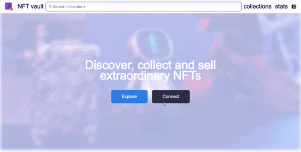

# NFT vault

This is a decentralized marketplace for buying and selling non-fungible tokens (NFTs) built on the Mumbai blockchain (testnet).

## Table of Contents

- [Demo](#demo)
- [Features](#features)
- [Installation and Setup](#installation-and-setup)
- [Usage](#usage)
- [Built With](#builtwith)
- [Deployment](#deployment)

## Demo 

## Features 

- Users can view collections of NFTs available for sale
- Users can purchase NFTs using Matic

## Installation and Setup 

1. Clone the repository: git clone [https://github.com/hinspared/nft-vault.git](https://github.com/hinspared/nft_vault.git).
2. Install dependencies: `npm install`.
3. Configure the necessary environment variables.
4. Start the development server: `npm run dev`.

# Usage 

Prerequisites:

- MetaMask Wallet: Install the [MetaMask](https://metamask.io/) browser extension and configure it to connect to the [Mumbai network (testnet)](https://wiki.polygon.technology/docs/develop/metamask/config-polygon-on-metamask).

1. Access the application at http://localhost:3000.
2. Browse the available collections of NFTs.
3. Select an NFT and proceed with the purchase using the Matic.

## Built With 

- [Typescript](https://www.typescriptlang.org)
- [NextJS](https://nextjs.org)
- [Prisma](https://prisma.io)
- [TailwindCSS](https://tailwindcss.com)
- [Thirdweb SDK](https://thirdweb.com)

## Deployment 

Follow deployment guides for [Vercel](https://create.t3.gg/en/deployment/vercel), [Netlify](https://create.t3.gg/en/deployment/netlify) and [Docker](https://create.t3.gg/en/deployment/docker) for more information.
